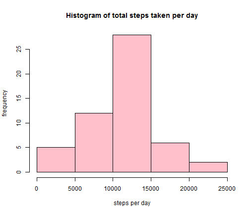
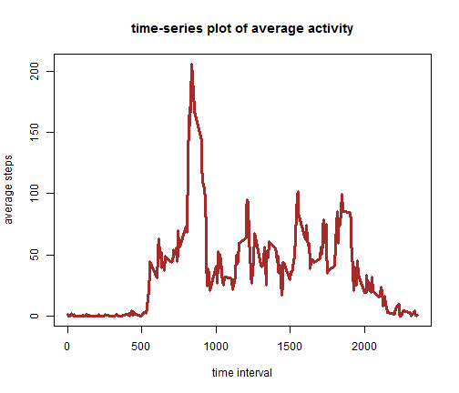
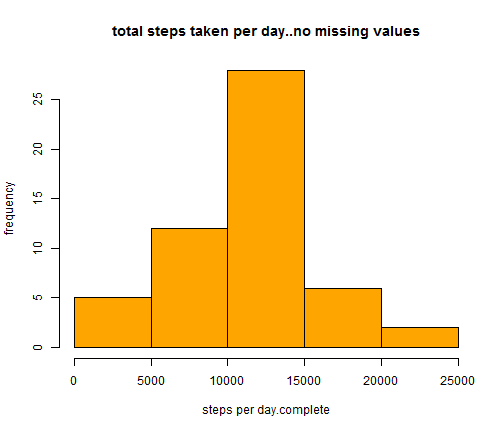
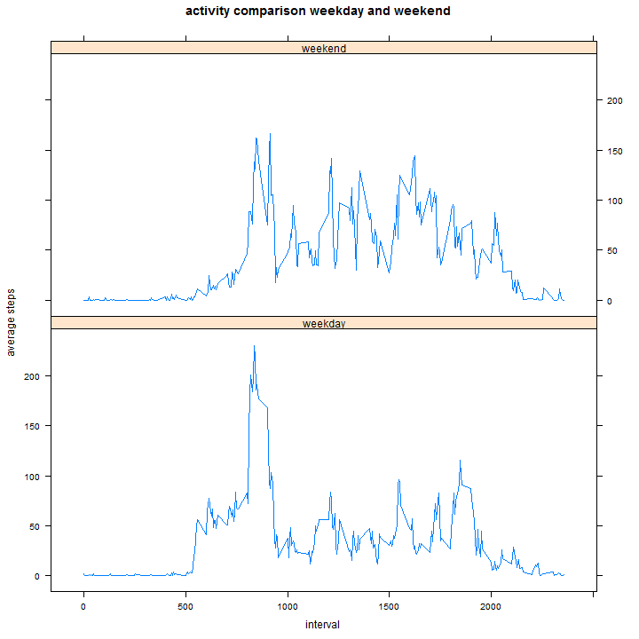

Exploration of activity data
========================================================

The data is checked in github as a zipped file and the file is unzipped into a csv format and prepared for further analysi


```r
unzip("activity.zip", "activity.csv")
activity_data <- read.csv("activity.csv");
```
re-modelling the data for total number of steps and plotting the histogram for steps

```r
steps_per_day <- aggregate(activity_data$steps, by =list(activity_data$date), FUN=sum)
library(data.table)
```

```
## Warning: package 'data.table' was built under R version 3.0.3
```

```r
setnames(steps_per_day, c("date", "steps.p.day"))
```
embedding the histogram plot 


```r
hist(steps_per_day$steps.p.day, col ="pink",main = "Histogram of total steps taken per day",
     xlab ="steps per day", ylab="frequency")
```

 

calculating the mean and median of steps per day


```r
mean_steps.p.day <- round(mean(steps_per_day$steps.p.day, na.rm=TRUE),digits=1)
median_steps.p.day <- median(steps_per_day$steps.p.day, na.rm=TRUE)
m1.df <- data.frame(mean.steps=mean_steps.p.day,median.steps=median_steps.p.day, row.names ="original")
print(m1.df)
```

```
##          mean.steps median.steps
## original      10766        10765
```


reshaping the data to average for each 5 minute time interval over all days

```r
step_by_interval <- aggregate(activity_data$steps, by = list(activity_data$interval), FUN= mean, na.rm=TRUE)
setnames(step_by_interval, c("time.interval", "average.steps"))
```
plotting time series over the intervals


```r
plot(step_by_interval$time.interval,step_by_interval$average.steps, type="l",main = "time-series plot of average activity",
     xlab = "time interval", ylab= "average steps", col = "brown",lwd =3.0)
```

 
To calculate the number of missing values in activity data,

```r
rows_with_NA <- sum(!complete.cases(activity_data))
```

We take a strategy of filling in the missing values of "NA" steps by replacing them with average of that 5 minute interval, averaged over all the dates. To achieve this we add another column with the average steps to activity data and replace "NA" values with values from that column. R-code to achieve it is given below,

```r
interval_ave_activity <- rep(step_by_interval$average.steps, nrow(steps_per_day))
merge_activity <- cbind(activity_data,interval_ave_activity)
merge_activity$steps[is.na(merge_activity$steps)] <- merge_activity$interval_ave_activity[is.na(merge_activity$steps)]
activity_data_complete <- merge_activity[,1:3]
```
Now we re-calculate the mean and median for steps taken per day

```r
steps.p.day.complete <- aggregate(activity_data_complete$steps, by =list(activity_data_complete$date), FUN=sum)
setnames(steps.p.day.complete, c("date","steps"))
mean.steps.p.day.complete <- round(mean(steps.p.day.complete$steps), digits=1)
median.steps.p.day.complete <- round(median(steps.p.day.complete$steps),digits=1)

m2.df <- data.frame(mean.steps=mean.steps.p.day.complete,median.steps=median.steps.p.day.complete, 
                    row.names ="estimated")
print(m2.df)
```

```
##           mean.steps median.steps
## estimated      10766        10766
```
The mean and median of the values are very close to the earlier values calculated 

```r
m.df <- rbind(m1.df,m2.df)
print(m.df)
```

```
##           mean.steps median.steps
## original       10766        10765
## estimated      10766        10766
```
and we can conclude that replacing the missing values with mean does not affect the overall nature of the data. We plot the daily steps histogram to compare with the earlier histogram and the nature is similar


```r
hist(steps_per_day$steps.p.day, col ="orange",main = "total steps taken per day..no missing values",
     xlab ="steps per day.complete", ylab="frequency")
```

 
To compare the activity between weekday and weekend we first define a function that will take the date values and determine whether that is a weekday or weekend. We use Chron package to achieve it.

```r
library(chron)
```

```
## Warning: package 'chron' was built under R version 3.0.3
```

```r
isWeekend <- function(x1){
  if(chron::is.weekend(x1)){
    return("weekend")
  }
  else{
     return("weekday")
  }
}
```
Now we add another column to the original data frame that indicates the record is for a weekday or weekend and then we reshape the data based on the 5 minute interval and weekday/weekend

```r
day.of.week.activity <- sapply(as.Date(activity_data$date),FUN=isWeekend )

activity.data.week <- cbind(activity_data_complete,day.of.week.activity)
activity.data <- activity.data.week[-c(2)]
setnames(activity.data,"day.of.week.activity", "day.of.week" )
summary.activity.data <- aggregate(activity.data$steps, 
                                   by = list(activity.data$interval,activity.data$day.of.week), FUN=mean)
setnames(summary.activity.data, c("interval","day.of.week","steps"))
summary.activity.data$day.of.week <- as.factor(summary.activity.data$day.of.week)
```
we use lattice plotting system for comparing the data

```r
library(lattice)
```

```
## Warning: package 'lattice' was built under R version 3.0.3
```


```r
xyplot(steps~interval|day.of.week,data= summary.activity.data, type= "l",layout=c(1,2), xlab="interval", 
       ylab="average steps", main = "activity comparison weekday and weekend")
```

 
We note that the activity in the interval of 500-1000 minutes, of 5-minute time interval is higher on weekdays than 
weekends. This is expected as it is between 8 am to 4 pm on a working day, the time of high activity.

